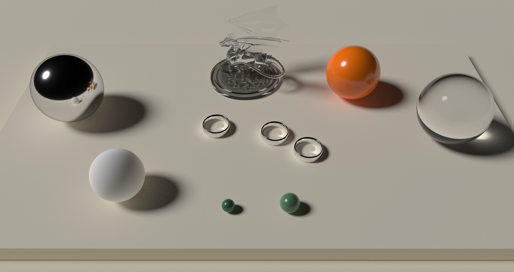
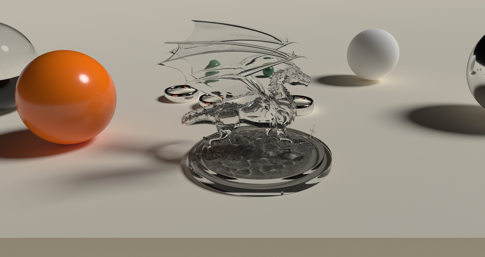

OptixPathTracer
==========

Render Time: 6 minutes on a GTX 750ti

A physically based path tracer with support for Disney BRDF.

This was created by putting together bits and pieces from the Nvidia's Optix advanced samples introduction tutorials.
The feature set is very basic since this is just a learning excercise, so if you see horribly written code or things that
can be done in a much better way please do share :)

Features
--------
( Most were part of existing code from the Nvidia's advanced optix samples )  
- Unidirectional Path Tracing  
- Disney BRDF  
- Simple Glass BRDF  
- Sphere and Rect lights  
- Multiple importance sampling  
- Mesh Loading
- Simple Scene file (Basically stolen from Miles Macklin's excellent tinsel renderer) (https://github.com/mmacklin/tinsel) so all credits go to him.

Following are some scenes rendered with the path tracer
--------
Coffee Pit (Render Time: 4 minutes. 1k spp)

Hyperion Scene (Render Time: Quite long)

Thanks to Simon Kallweit for helping me out with the importance sampling code. He also has a nice write up of his implementation
(http://simon-kallweit.me/rendercompo2015/).

Models are from [Benedikt Bitterli's Rendering Resources](https://benedikt-bitterli.me/resources).

